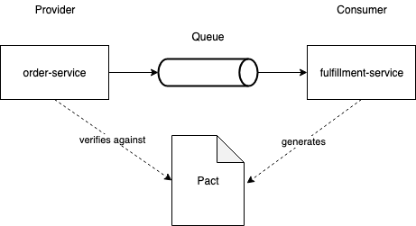

# An example project to demonstrate asynchronous contract testing

This is an example of how to use [Pact](https://pact.io) for contract testing between two services that are separated by a queue. The version 3 of the [Pact Specification](https://github.com/pact-foundation/pact-specification/tree/version-3#introduces-messages-for-services-that-communicate-via-event-streams-and-message-queues) introduces interactions for services that communicate via message queues.

The project consists of a producing service, the *checkout-service* and two consuming services, a *fulfillment-service* and a *billing-service*.

The checkout-service produces orders and sends them to a queue. These orders are picked up by the two other services. The fulfillment-service is interested in the item names and the
customerId and the billing-services sums up the prices of the individual items.
The second service is the fulfilment-service which is able to consume orders.

Message passing is done via [Testcontainers](https://www.testcontainers.org/) which provides a mock for Amazon's Simple Queueing Service (SQS). 

